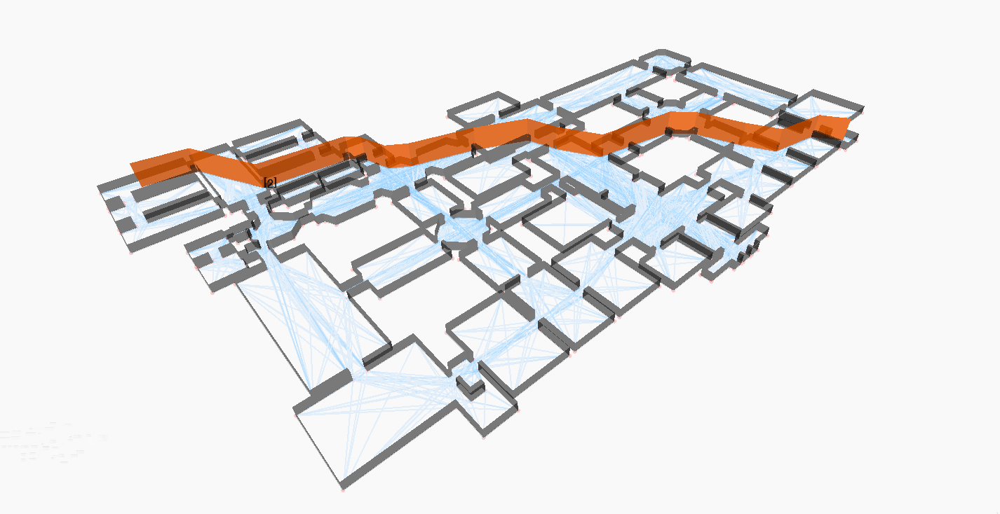

# Graphical for Dynamo

**Graphical for Dynamo** is the implementation of [Graphical](https://github.com/alvpickmans/Graphical) project on the [Dynamo](https://github.com/DynamoDS/Dynamo) platform as a package, plus some extra helper methods to handle geometry.

